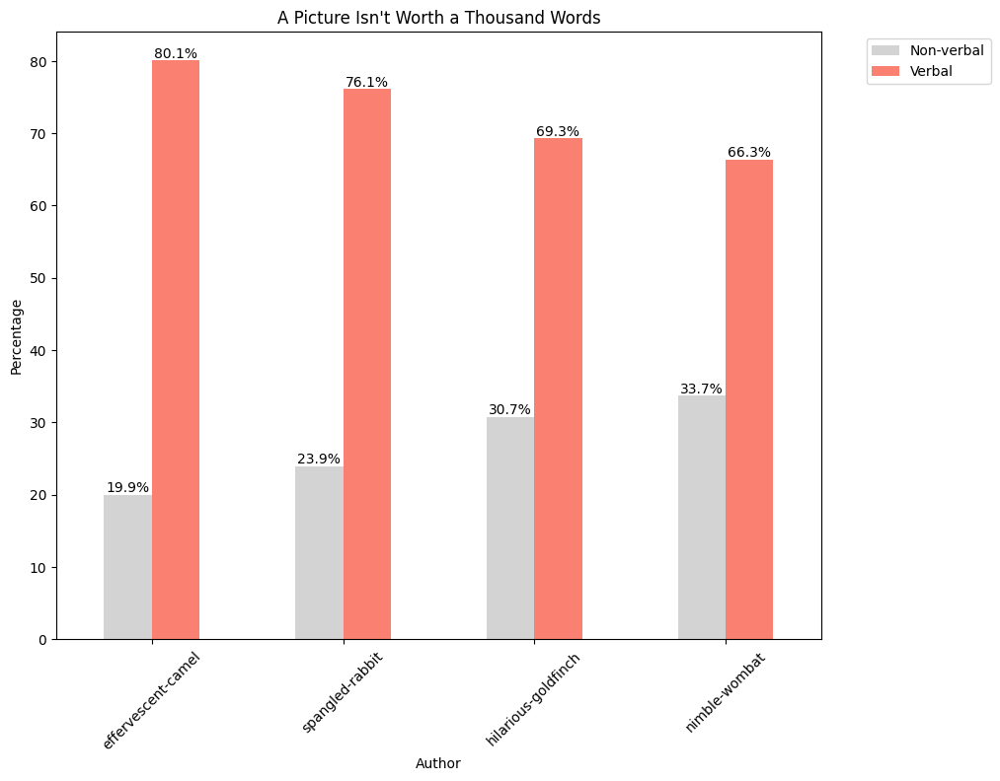
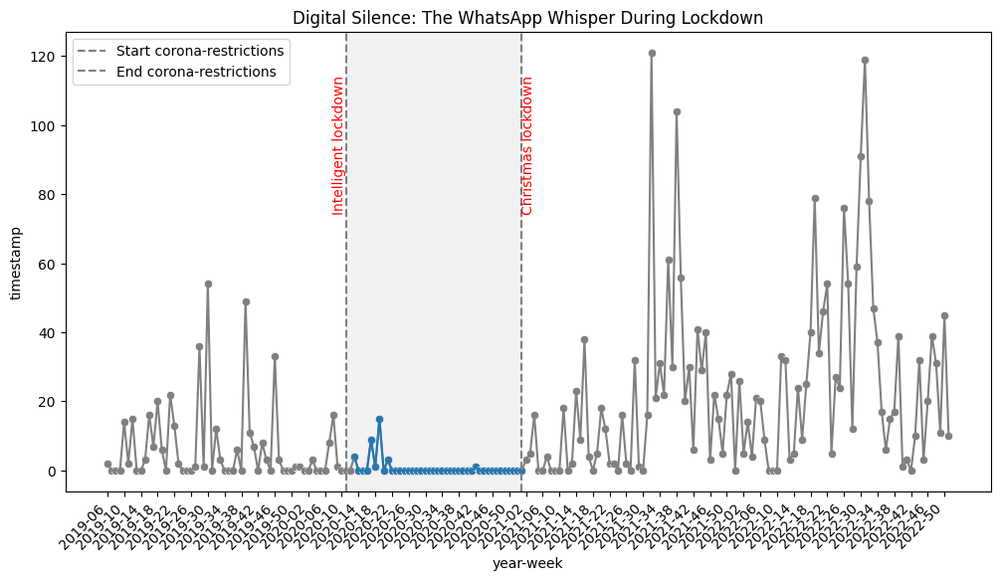
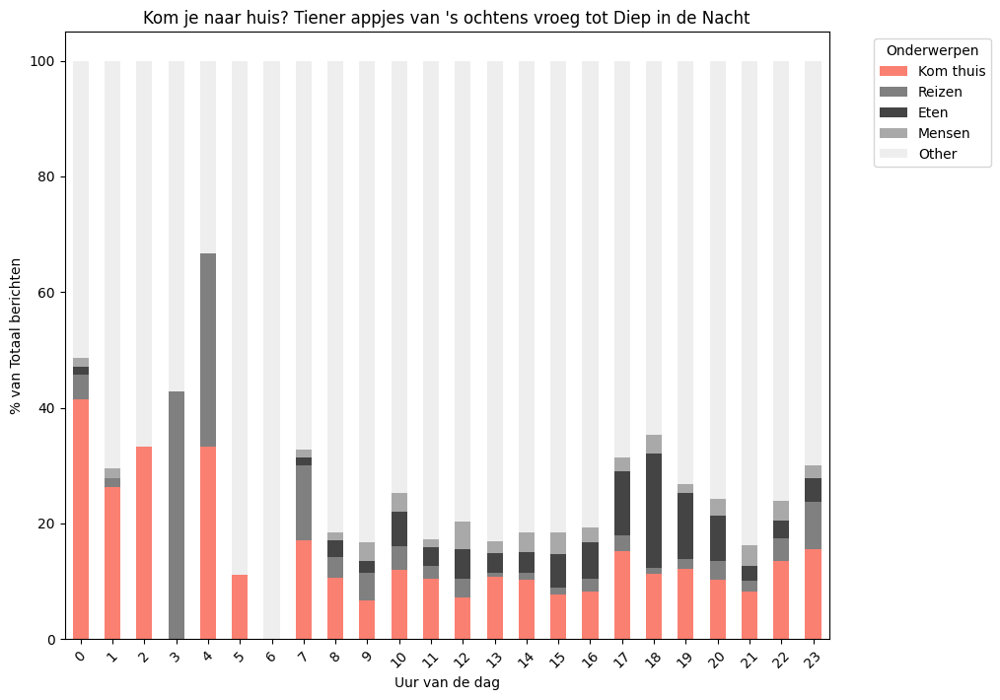
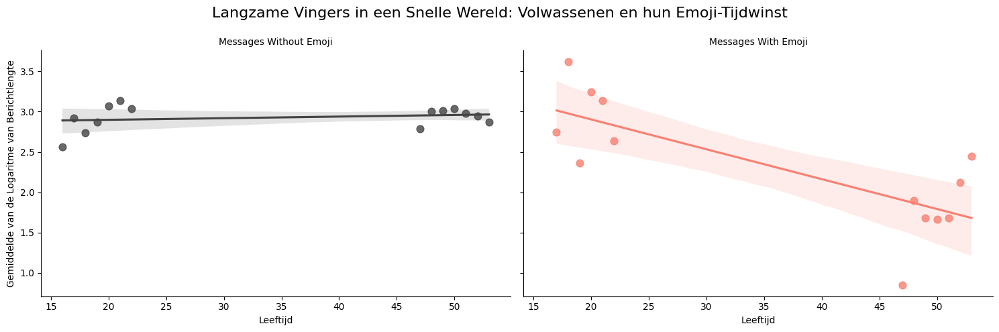
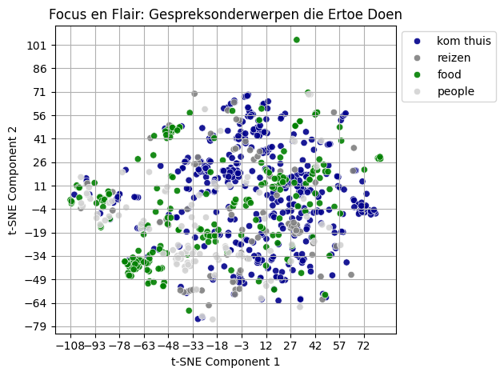
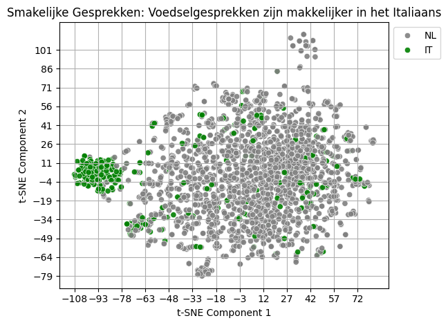

# Data Analysis & Visualization: Rapport

***Naam: Francesca Paulin Tumburus***

***Studentnr: 1882135***

***Cursus: Data Analysis and Visualization***

***Datum: 05-11-2024***

# Inleiding

Dit rapport beschrijft de eindopdracht van de cursus 'Data Analysis & Visualization', onderdeel van de Master-opleiding Applied Data Science.

# 1.1 Dataset: Whatsapp data

De datavisualisaties in dit rapport zijn gebaseerd op een eigen dataset afkomstig van een bestaande gezins-app. De dataset bevat 5.161 berichten die zijn uitgewisseld tussen november 2018 en juli 2024. De WhatsApp-groep bestaat uit vier gebruikers: twee volwassenen en twee tieners van wisselede leeftijden, van 16 tot 20 jaar. De gesprekken richten zich op de dagelijkse gang van zaken. Met visualisaties worden onderwerpen, leeftijdsverschillen en belangrijke veranderingen, zoals de coronaperiode, blootgelegd.

# 1.2 Github Repository
In de bijgeleverde READ.md vindt u de installatieinstructies. De link naar de github repository is: ![github.com/FP-byte/MADS-DAV-FP] (https://github.com/FP-byte/MADS-DAV-FP).

# 1.3 Data preprocessing en data-cleaning
De dataset is vooraf geanonimiseerd en het bronbestand is opgeslagen in de map 'processed' als uitgangspunt voor de visualisaties. Wegens privacyoverwegingen is de dataset en de bijgewerkte bronbestanden niet in de github meegeleverd. 
De data is vervolgens bewerkt door de volgende extra stappen uit te voeren:
- alle autheur en emailadressen zijn uit de berichten verwijderd 
- twee autheur zijn samengevoegd (dezelfde gebruiker kreeg een ander nummer)
- de berichten van een autheur is verwijderd (ging om sturen van systeem berichten)
- emoji-detectie verbeterd (zijn ontbrekende sets van ASCII-codes toegevoegd)
  
Voor elke visualisatie is verder een preprocessing-stap ingebouwd om de visualisatie mogelijk te maken:
### Preprocessing visualisatie 1
Non-verbale data is gefilterd op basis van media-inhoud, berichten met uitsluitend emoji's en gedeelde URL’s.
De verbale data is verder ingedeeld per taal, er worden twee talen gebruikt, Italiaans en Nederlands, wat verder ook nuttig was voor het bepalen van de meest voorkomende termen.
### Preprocessing visualisatie 2
De te visualiseren berichten zijn geselecteerd voor een kleinere tijdsframe rondom de corona-periode en erna om effectievere visualisatie te realiseren.
### Preprocessing visualisatie 3
De berichten zijn gefilterd op basis van zoektermen, geselecteerd op basis van veelvoorkomende woorden in de dataset in beide talen. Vervolgens is er handmatig een lijst samengesteld van betekenisvolle termen en zijn deze in een verzamelcategorie ondergebracht. 
### Preprocessing visualisatie 4
In de dataset is een leeftijdskolom toegevoegd op basis van geboortejaar van de auteurs. Bovendien zijn de regex patronen voor emoji-detectie en verwijderen van gebruikers toegevoegd aan de regex die tijdens de cleanup werd gebruikt.
### Preprocessing visualisatie 5
The processing step maakt gebruik van de data geleverd in de eerdere visualisatie en wordt gebruik gemaakt van embedding class en dimensie-reductie t-SNE om de basisdata voor de visualisatie te realiseren.

### Visualisatie 1: Tekstuele Gesprekken: Wanneer Woorden Luidere Spreken Dan Beelden

De categorievisualisatie biedt een eerste blik op de dataset, waarin verbale en non-verbale communicatie met elkaar worden vergeleken. Deze visualisatie is een belangrijke stap in het blootleggen van communicatiepatronen binnen de dataset: het toont een samenvatting van variaties in communicatiestijlen per gebruiker. Wie stuurt de meeste of de minste foto's en emoji's? Wie schrijft het meest?
De titel benadrukt een cruciale eigenschap van de data: de chat is duidelijk niet gericht op het delen van media-inhoud, maar het is waarschijnlijk zeer functioneel. Dit is niet verrassend: tieners delen liever geen foto's met hun ouders!

## Visuele kenmerken
De pre-attentieve Processing komt tot stand gekomen door de keuze van kleuren en de ordening van de balken. Het kleurcontrast biedt een globale eerste indruk en trekt onmiddellijk de aandacht naar de verbale aspecten van de dataset. De lengte van de balken is opvallend, en de aflopende volgorde van de zalmkleurige balken onthult variaties per auteur. Het contrast in kleur zorgt ervoor dat de "Verbal"-resultaten prominent naar voren komen en als belangrijker worden ervaren.
De ordening van de zalmkleurige balken van hoog naar laag, creëert een gevoel van continuïteit en visuele balans. 
De gegroepeerde plaatsing van de balken per auteur (proximity) stelt de kijker in staat om snel en eenvoudig de "Non-verbal" en "Verbal"-resultaten per auteur te vergelijken en overeenkomsten en verschillen te herkennen (similarity). Hierdoor is de voorkeur in communicatietype per gebruiker ook makkelijk te lezen. De legende fungeert als een subtiele vorm van afbakening, die de categorieën visueel scheidt en het begrip van de kleuren ondersteunt.

### Visualisatie 2: Digital stilte in tijden van lockdown: van pixel naar persoonlijk

Deze timeseries-visualisatie is een overzicht van een periode tussen november 2019 en begin 2023. De periode is ruim genoeg genomen om voldoende vergelijkingsmateriaal te bieden en tijdsgebonden verandering te tonen. De titel maakt de boodschap duidelijk, er wordt niets gedeeld in de chat tijdens de lockdown periodes, er is ook weinig te vertellen. Iedereen is thuis, de communicatie gaat dan vaker persoonlijk en niet digitaal.

## Visuele kenmerken
De preattemptive processing wordt gerealiseerd door middel van kleur en toevoeging van visuele elementen. Grijs is als basis (start with gray) en alle aandacht is gevestigd op het gebied tussen de verticale lijnen met het rode van de tekst en de kleur van het grafiek.
De visualisatie maakt ook gebruik van proximity, similarity en enclosure om visuele helderheid te bevorderen. Proximity wordt toegepast door de tijdstempels langs de x-as te groeperen op weekbasis, wat de interpretatie van trends en tijdsgebonden veranderingen mogelijk maakt. Similarity komt tot uiting in het consistente kleurgebruik van de punten en lijnen die één type communicatieactiviteit vertegenwoordigen, wat visuele eenheid creëert. Enclosure wordt geïllustreerd door de grijze schaduw tussen de start en het einde van de lockdown, wat helpt om de focus van de kijker op deze specifieke periode te vestigen en de impact ervan op het communicatiepatroon te benadrukken.

### Visualisatie 3: Kom je naar huis? Tiener appjes van 's ochtens vroeg tot Diep in de Nacht

Deze distributie-visualisatie biedt een analyse van verschillende gezinsgerelateerde onderwerpen en bouwt voort op de eerdere categorisatie van verbale en non-verbale communicatie. De focus ligt vooral op de onderwerpen van de berichten, aangezien dit het grootste deel van de data uitmaakt. Tijdens de analyse viel op hoe vaak er werd gesproken over eten en de locaties van gezinsleden die op reis waren. Vooral de nachtelijke berichten kwamen naar voren als opmerkelijke interacties. Deze chats zijn kenmerkend voor een bepaalde fase in het leven van tieners en hun ouders. Ouders die met tieners omgaan, moeten voortdurend subtiel op hun kinderen letten en grenzen stellen. De visualisatie laat zien hoeveel ouders hiermee bezig zijn!

## Visuele kenmerken
De preattemptive processing is gerealiseerd door het gebruik van opvallende kleuren voor het hoofdthema ('Kom je naar huis'), dat betrekking heeft op de nachtelijke gesprekken. De andere thema's zijn weergegeven in grijstinten om te benadrukken dat er meerdere onderwerpen worden besproken en dat dit een exploratie ervan is. De visualisatie toont de volledige dataset, inclusief non-verbale berichten onder de overige categorie, vandaar deze de meeste berichten inhoud en de meeste lichte grijstint heeft.

### Visualisatie 4: Langzame Vingers in een Snelle Wereld: Volwassenen en hun Emoji-Tijdwinst
De relaties visualisatie toont een bijzonder verschil. Berichten met emoij's zijn bij jonge mensen praktisch net zo lang als zonder emoij's. Bij volwassenen is het vaak zo dat woorden 'vervangen' worden door emoij's om minder te type of simpelweg omdat het minder tijd kost. De visualisatie toont de twee gevallen en de relatie tussen leeftijd en lengte van een berichten.

## Visuele kenmerken
De preattemptive processing maakt gebruik van kleurverschillen in twee naast elkaar getoonde visualisaties (face grid). De lijn is het visuele kenmerk dat als eerste wordt opgemerkt en het verhaal vertelt, terwijl het ook een gevoel van continuïteit biedt. Daarnaast wordt er gebruikgemaakt van similarity en proximity concepten: de data is geaggregeerd op basis van emoji-gebruik en dit wordt weergegeven in een gegroepeerd formaat met grote bolletjes.

### Visualisatie 5: Focus en Flair: Gespreksonderwerpen die Ertoe Doen

De onderwerpen vormen van de chat zijn een duidelijk patroon die via het toepassen van dimensiereductie met t-SNE naar voren. Vooral de thema's rondom voedsel en eerdere berichten naar tiener van type 'kom thuis' zijn samengevoegd in herkenbare clusters en in het blauw weergegeven.

Als we ook de verdeling van talen in dezelfde dataset bekijken, valt op dat de kluster in het groen is zowel per taal als per onderwerp zeer specifiek: de conversaties gaan over eten en vakanties in Italie en dus ook in het Italiaas. 

De preattentieve verwerking maakt gebruik van kleurverschillen om de verschillende onderwerpen en talen te visualiseren. Proximity en similarity worden weergegeven door datapunten dicht bij elkaar te tekenen. Elke coördinaat in t-SNE vertegenwoordigt een afstand in gelijkenis qua betekenis.

