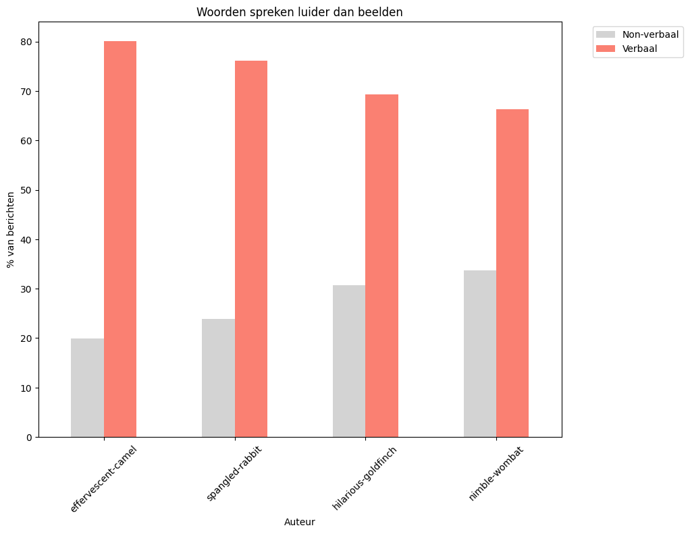
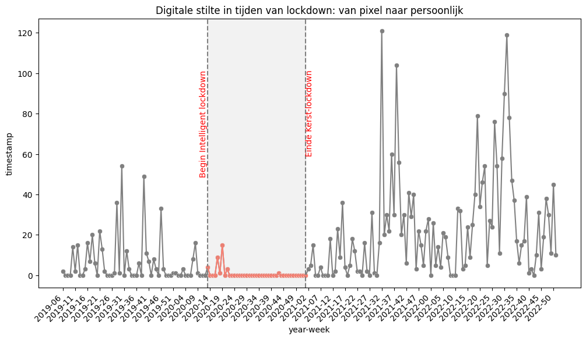
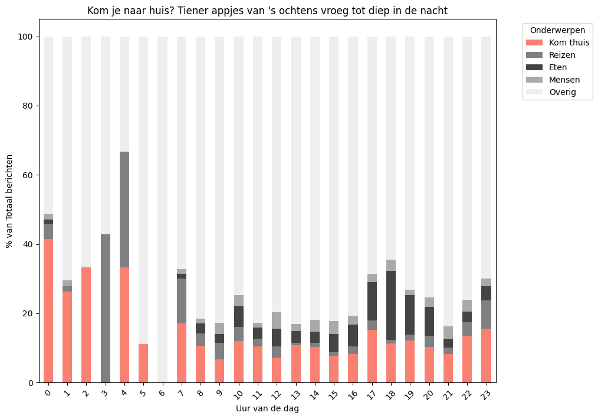
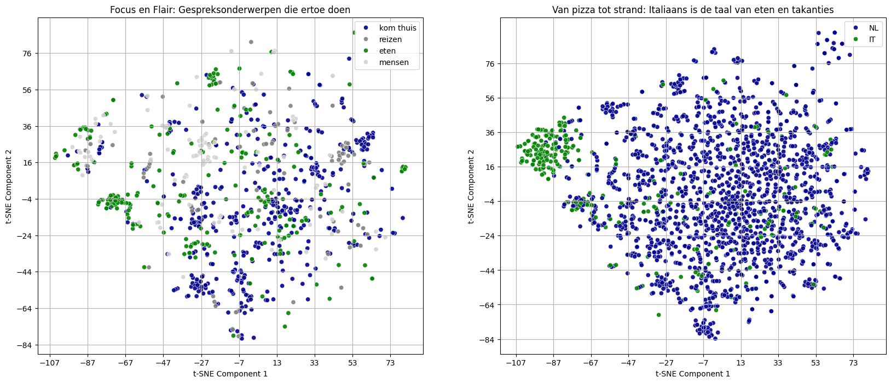

# Verslag WhatsApp-Data Analyse en Visualisatie
## Taal, Thema's en Generatieverchillen: gezinscommunicatie onder de loep 

***Cursus: Data Analysis and Visualization***

***Naam: Francesca Paulin***

***Studentnr: 1882135***

***Datum: 05-11-2024***

# Inleiding: Dataset and repo

Dit verslag beschrijft de eindopdracht van de cursus 'Data Analysis & Visualization', onderdeel van de Master-opleiding Applied Data Science.

## 1.2 Github Repository
In de bijgeleverde READ.md vindt u de installatieinstructies. De link naar de github repository is: [github.com/FP-byte/MADS-DAV-FP](https://github.com/FP-byte/MADS-DAV-FP).

## 1.1 Dataset: Whatsapp data

De datavisualisaties in dit rapport zijn gebaseerd op een eigen dataset afkomstig van een bestaande gezins-app. De dataset bevat 5.161 berichten die zijn uitgewisseld tussen november 2018 en juli 2024. De WhatsApp-groep bestaat uit vier gebruikers: twee volwassenen en twee tieners van wisselede leeftijden, van 16 tot 20 jaar. De gesprekken richten zich op de dagelijkse gang van zaken. Met visualisaties worden onderwerpen, leeftijdsverschillen en belangrijke veranderingen, zoals de coronaperiode, blootgelegd.

## 1.2 Data cleaning en data processing

De dataset is vooraf geanonimiseerd en het bronbestand is opgeslagen in de map 'processed' als uitgangspunt voor de visualisaties. Wegens privacyoverwegingen is de dataset en de bijgewerkte bronbestanden niet in de github meegeleverd. 
De data is vervolgens bewerkt om de dataruis te verminderen. De volgende extra stappen zijn uitgevoerd:
- alle autheursnamen, telefoonnummer en emailadressen zijn uit de berichten verwijderd
- twee autheur zijn samengevoegd (dezelfde gebruiker kreeg een ander nummer)
- de berichten van een autheur is verwijderd (ging om sturen van systeem berichten)
- emoji-detectie is verbeterd (zijn ontbrekende sets van ASCII-codes toegevoegd)
  
Voor elke visualisatie is verder een preprocessing-stap ingebouwd om de visualisatie mogelijk te maken. 
Hieronder een overzicht van de toegevoegde data-kommen met uitleg:
- language: is gefilterd op basis van taalgebruik. Media-inhoud, berichten met uitsluitend emoji's en gedeelde URL’s zijn vallen niet onder taal maar onder non-verbale uitingen. Er zijn twee talen gebruikt, Italiaans en Nederlands. (Nodig voor visualizatie 1,2,5)
- topic: De berichten zijn gefilterd op basis van zoektermen, geselecteerd op basis van veelvoorkomende woorden in de dataset in beide talen. Vervolgens is er handmatig een lijst samengesteld van betekenisvolle termen en zijn deze in een verzamelcategorie ondergebracht. De zoektermen kunt u in de configuratie-bestand vinden. (Nodig voor visualizatie 2, 5)
- age: leeftijdskolom berekend op basis van geboortejaar van de auteurs. (Nodig voor visualizatie 4)
- date,isoweek,year-week,hour,year zijn extraties en berekeningen uit tijdskolom 'timestamp'. (Nodig voor visualizatie 2, 4)
- message_length,log_len: lengte van berichten en de logaritme hiervan. (Nodig voor visualizatie 4)
- emoij_status: categoriekolom, met of zonder emoji. (Nodig voor visualizatie 4)

## Visualisatie 1: Woorden spreken luider dan beelden

De categorievisualisatie biedt een eerste inzicht in de dataset: een vergelijking tussen verbale en non-verbale communicatie. Deze visualisatie identificeert de eerste communicatiepatroon binnen de data en het biedt een indruk over de verschillen in communicatiestijlen per gebruiker. Wie verstuurt de meeste foto's en emoji's? Wie schrijft de meeste berichten?

De titel legt de nadruk op een belangrijke eigenschap van de dataset: de chats zijn duidelijk niet gericht op het delen van foto's, maar zijn functioneel om in contact te blijven. Wat hierbij opvalt, is dat de meeste non-verbale communicatie afkomstig is van de volwassen. Misschien is dit niet verrassend: tieners delen doorgaans minder foto's met hun ouders!

### Visuele kenmerken
De *preattentieve processing* wordt bereikt door de kleurverschillen en eigenschappen van de balken. Het contrast in kleur zorgt ervoor dat de "Verbal"-resultaten prominent naar voren komen en als belangrijker worden ervaren en trekt de aandacht naar de verbale aspecten van de dataset. De lengte van de balken valt ook direct op. De volgorde van de zalmkleurige balken, van hoog naar laag, creëert een visueel gevoel van continuïteit en balans. De gegroepeerde plaatsing van de balken per auteur (*proximity*) maakt het gemakkelijk voor de kijker om snel de "Non-verbal" en "Verbal"-resultaten per auteur te vergelijken en overeenkomsten en verschillen te herkennen (*similarity*). Dit vergemakkelijkt het lezen van de voorkeur voor communicatietype per gebruiker.

## Visualisatie 2: Digital stilte in tijden van lockdown: van pixel naar persoonlijk

Deze time series-visualisatie biedt een overzicht van de periode tussen november 2019 en 1 januari 2023, met speciale aandacht voor de coronatijd. De titel maakt de boodschap duidelijk: tijdens de lockdownperiodes werd er nauwelijks gedeeld in de chat, simpelweg omdat er weinig te delen was. Iedereen was thuis, en de communicatie verschoof dan vaak van digitaal naar persoonlijk.

### Visuele kenmerken
De *preattentieve processing* in deze visualisatie wordt gerealiseerd door kleurgebruik en het toevoegen van visuele elementen. Grijs dient als de basiskleur (*start with gray*), waardoor de aandacht wordt getrokken naar de periode tussen de verticale lijnen, die zijn gemarkeerd met de rode tekst en de kleur van de grafiek. De gekozen tijdsperiode is breed genoeg om voldoende vergelijkingsmateriaal te bieden en de veranderingen door de tijd heen te tonen. 

De visualisatie maakt effectief gebruik van *proximity*, *similarity* en *enclosure* om de visuele helderheid te verbeteren. *Proximity* wordt toegepast door de tijdstempels op de x-as per week te groeperen, wat het gemakkelijker maakt om trends en tijdsgebonden veranderingen te interpreteren. De geselecteerde berichten zijn gefocust op een kleiner tijdsframe rondom de coronaperiodes en daarna, wat de visualisatie duidelijker en gerichter maakt.

*Similarity* komt tot uiting in het consistente kleurgebruik van de punten en lijnen, die elk één type communicatieactiviteit vertegenwoordigen. Dit creëert visuele eenheid en maakt het gemakkelijk om de verschillende soorten activiteit te onderscheiden. *Enclosure* wordt gebruikt door de grijze schaduw die de periode tussen de begin- en einddata van de lockdown markeert. Dit helpt de aandacht van de kijker te richten op deze specifieke periode en benadrukt de impact die de lockdowns hadden op het communicatiepatroon: de totale stilte.

## Visualisatie 3: Kom je naar huis? Tiener appjes van 's ochtens vroeg tot diep in de nacht

Deze distributie-visualisatie biedt een gedetailleerde analyse van de verschillende gezinsgerelateerde onderwerpen in de dataset, met de nadruk op de frequentie van berichten over specifieke thema's. Het bouwt voort op de eerdere categorisatie van verbale en non-verbale communicatie, maar legt de focus vooral op de inhoud van de berichten, aangezien dit het grootste deel van de data uitmaakt. Deze visualisatie geeft inzicht in het zorgzame, maar ook sturende karakter van ouder-kindcommunicatie, waarbij de nadruk ligt op praktische en soms dringende zaken, zoals het al dan niet naar huis komen van een tiener. 
De visualisatie maakt duidelijk hoeveel ouders hier daadwerkelijk mee bezig zijn!

### Visuele kenmerken
De *preattentive processing* wordt versterkt door het gebruik van opvallende kleuren voor het hoofdthema (‘Kom je naar huis?’), dat specifiek betrekking heeft op de nachtelijke gesprekken. De overige onderwerpen zijn in grijstinten weergegeven, wat de visuele nadruk legt op de belangrijkste thema’s zonder afbreuk te doen aan de andere gegevens. De balken die geen zalmroze data tonen, worden met behulp van closure aangevuld zodat de gehele trend toch zichtbaar blijft: 's nachts wordt er meer gechat over dit onderwerp. De visualisatie toont een distributie over de volledige dataset, inclusief de non-verbale berichten, die onder de categorie ‘overige’ vallen. Deze categorie bevat de meeste berichten en heeft daarom de lichtste grijstint, wat aangeeft dat non-verbale communicatie een significante rol speelt, maar minder opvalt dan de thematische inhoud van de nachtelijke gesprekken.

## Visualisatie 4: Langzame vingers in een snelle wereld: volwassenen en hun emoji-tijdwinst

De vierde visualisatie onthult een opvallend verschil tussen jongere en oudere gebruikers. Bij jongeren is het gebruik van emoji's nauwelijks van invloed op de lengte van hun berichten. Bij volwassenen daarentegen wordt vaak de voorkeur gegeven aan emoji's in plaats van woorden, niet alleen om minder te typen, maar ook omdat dit tijd bespaart. De visualisatie vergelijkt de lengte van berichten met en zonder emoji's en legt de relatie tussen leeftijd en berichtlengte duidelijk bloot. 

### Visuele kenmerken
In deze visualisatie wordt *preattentieve processing* gebruikt, waarbij kleurverschillen in de twee naast elkaar geplaatste grafieken (*face grid*) direct de aandacht trekken. De lijn in de visualisatie is het eerste visuele kenmerk dat opvalt en vertelt het verhaal, terwijl het ook zorgt voor een gevoel van continuïteit. Daarnaast worden de concepten van *similarity* en *proximity* toegepast: de data is geaggregeerd op basis van emoji-gebruik en visueel gepresenteerd in een gegroepeerd formaat met grote bolletjes, waardoor patronen in het gebruik van emoji's duidelijk zichtbaar worden.

### Visualisatie 5: Focus en flair: gespreksonderwerpen en voorkeurstaal

De onderwerpen in de chats volgen een duidelijk patroon, dat zichtbaar wordt door de toepassing van dimensiereductie via t-SNE. Vooral thema’s rondom eten en berichten naar tieners met het verzoek "kom thuis" komen samen in herkenbare clusters, die in de visualisatie in het blauw worden weergegeven. Een belangrijk inzicht is dat de voorkeurstaal contextafhankelijk is en samenhangt met het onderwerp: zo is Italiaans vooral gebruikelijk in gesprekken over eten en tijdens vakanties, wat duidelijk zichtbaar is in de taalklusters. Deze bevinding komt overeen met de realiteit. Het gezin is tweetalig, maar Italiaans wordt vooral gesproken tijdens vakanties in Italië en bij alles wat met Italië te maken heeft, zoals eten en familiezaken.

### Visuele kenmerken
De *preattentieve processing* maakt gebruik van kleurverschillen om de verschillende gespreksonderwerpen en talen visueel te onderscheiden. De principes van *proximity*, *similarity* en *closure* komen tot uiting door datapunten dicht bij elkaar te  en dezelfde kleur te geven. Bij elke punt-coördinaat in de t-SNE de afstand weerspiegelt de mate van gelijkenis.

# Samenvatting analyse

De dataset biedt waardevolle inzichten in de gezinscommunicatie, waarbij thema’s, taalgebruik en generatieverschillen duidelijk naar voren komen. Terugkerende onderwerpen zoals eten en berichten van ouders aan tieners met het verzoek om naar huis zijn door de analyse naar voren gekomen. Deze thema’s vormen de kern van veel gezinsgesprekken, wat goed zichtbaar is in de derde en vijfde visualisatie. De dimensiereductie via t-SNE heeft deze patronen herkent door clusters te vormen op basis van onderwerpen zoals de gesprekken over eten en "kom thuis"-berichten, wat wijst op een sterke thematische samenhang in de communicatie. Zodra deze thema’s, zoals het eten, vervallen en iedereen al thuis is, valt de communicatie af, wat te zien is in de 'lockdown'-visualisatie. De 'digitale stilte' tijdens de lockdowns suggereert dat gezinsleden de chat vooral 'handig' vinden om in contact te zijn juist als ze niet thuis zijn.

De visualisaties bieden inzicht in taalgebruik. Zo blijkt uit de data dat Italiaans vaak de voorkeurstaal is voor gesprekken over vakantie en eten, wat de hypothese ondersteunt dat de keuze voor taal sterk afhankelijk is van de context en het onderwerp van gesprek. Ouders geven vaak een subtiele sturing aan hun kinderen, vooral als het gaat om praktische zaken zoals het weer naar huis komen, en de daarbij behorende afspraken rondom het eten. De communicatie is zorgzaam duidt op een zachte, indirecte benadering van ouderlijke begeleiding.

Een ander interessant patroon is de manier waarop verschillende in communicatiestijl tussen de twee generaties. Jongeren gebruiken vaker emoji’s, terwijl volwassenen geneigd zijn woorden te vervangen door emoji’s om tijd te besparen of simpelweg omdat ze minder snel typen. Ook sturen jonge tieners minder foto's naar hun ouders dan andersom.

Kortom, de visualisaties bieden inzicht in de subtiele interacties tussen ouders en tieners, en tonen de invloed van context — zoals lockdowns en dagelijkse gezinsdynamieken — op de manier waarop gezinsleden met elkaar communiceren en de verschillen in communicatiestylen.